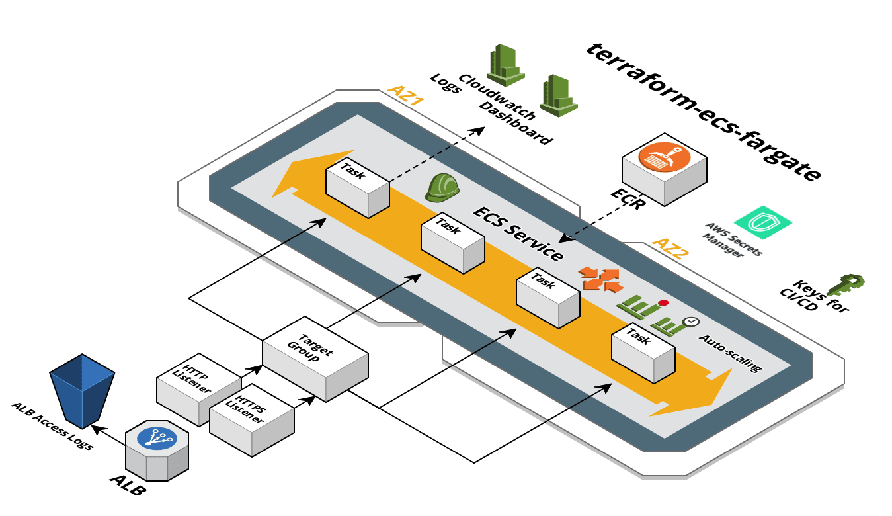

# Terraform ECS Fargate

A set of Terraform templates used for provisioning web application stacks on [AWS ECS Fargate][fargate].

**Note**: We suggest moving away from this template to our newer modular version. This repo will still receive updates to maintain compatability as terraform and the AWS providers evolve, but most newer features will be implemented in the module.  You can find the module here: [https://github.com/turnerlabs/terraform-ecs-fargate-module](https://github.com/turnerlabs/terraform-ecs-fargate-module)



The templates are designed to be customized.  The optional components can be removed by simply deleting the `.tf` file.

The templates are used for managing infrastructure concerns and, as such, the templates deploy a [default backend docker image](env/dev/ecs.tf#L26).  We recommend using the [fargate CLI](https://github.com/turnerlabs/fargate) for managing application concerns like deploying your actual application images and environment variables on top of this infrastructure.  The fargate CLI can be used to deploy applications from your laptop or in CI/CD pipelines.

## Components

### base

These components are shared by all environments.

| Name | Description | Optional |
|------|-------------|:---:|
| [main.tf][bm] | AWS provider, output |  |
| [state.tf][bs] | S3 bucket backend for storing Terraform remote state  |  |
| [ecr.tf][be] | ECR repository for application (all environments share)  |  ||

### env/dev

These components are for a specific environment. There should be a corresponding directory for each environment
that is needed.

| Name | Description | Optional |
|------|-------------|:----:|
| [main.tf][edm] | Terrform remote state, AWS provider, output |  |
| [ecs.tf][ede] | ECS Cluster, Service, Task Definition, ecsTaskExecutionRole, CloudWatch Log Group |  |
| [lb.tf][edl] | ALB, Target Group, S3 bucket for access logs  |  |
| [nsg.tf][edn] | NSG for ALB and Task |  |
| [lb-http.tf][edlhttp] | HTTP listener, NSG rule. Delete if HTTPS only | Yes |
| [lb-https.tf][edlhttps] | HTTPS listener, NSG rule. Delete if HTTP only | Yes |
| [dashboard.tf][edd] | CloudWatch dashboard: CPU, memory, and HTTP-related metrics | Yes |
| [role.tf][edr] | Application Role for container | Yes |
| [cicd.tf][edc] | IAM user that can be used by CI/CD systems | Yes |
| [autoscale-perf.tf][edap] | Performance-based auto scaling | Yes |
| [autoscale-time.tf][edat] | Time-based auto scaling | Yes |
| [logs-logzio.tf][edll] | Ship container logs to logz.io | Yes |
| [secretsmanager.tf][edsm] | Add a Secrets Manager secret with a CMK KMS key. Also gives app role and ECS task definition role access to read secrets from Secrets Manager | Yes |
| [secrets-sidecar.tf][ssc] | Adds a task definition configuration for deploying your app along with a sidecar container that writes your secrets manager secret to a file. Note that this is dependent upon opting in to `secretsmanager.tf`. | Yes |
| [ssm-parameters.tf][ssm] | Add a CMK KMS key for use with SSM Parameter Store. Also gives ECS task definition role access to read secrets from parameter store. | Yes |
| [ecs-event-stream.tf][ees] | Add an ECS event log dashboard | Yes |


## Usage

Typically, the base Terraform will only need to be run once, and then should only
need changes very infrequently. After the base is built, each environment can be built.

```
# Move into the base directory
$ cd base

# Sets up Terraform to run
$ terraform init

# Executes the Terraform run
$ terraform apply

# Now, move into the dev environment
$ cd ../env/dev

# Sets up Terraform to run
$ terraform init

# Executes the Terraform run
$ terraform apply
```

##### Important (after initial `terraform apply`)

The generated base `.tfstate` is not stored in the remote state S3 bucket. Ensure the base `.tfstate` is checked into your infrastructure repo. The default Terraform `.gitignore` [generated by GitHub](https://github.com/github/gitignore/blob/master/Terraform.gitignore) will ignore all `.tfstate` files; you'll need to modify this!

## fargate-create

Alternatively you can use the [fargate-create CLI](https://github.com/turnerlabs/fargate-create) to scaffold new projects based on this template.

install
```shell
curl -s get-fargate-create.turnerlabs.io | sh
```

create an input vars file (`terraform.tfvars`)
```hcl
# app/env to scaffold
app = "my-app"
environment = "dev"

internal = true
container_port = "8080"
replicas = "1"
health_check = "/health"
region = "us-east-1"
aws_profile = "default"
saml_role = "admin"
vpc = "vpc-123"
private_subnets = "subnet-123,subnet-456"
public_subnets = "subnet-789,subnet-012"
tags = {
  application   = "my-app"
  environment   = "dev"
  team          = "my-team"
  customer      = "my-customer"
  contact-email = "me@example.com"
}
```

```shell
$ fargate-create -f terraform.tfvars
```


## Additional Information

+ [Base README][base]

+ [Environment `dev` README][env-dev]


Install pre-commit hook that checks terraform code for formatting
```sh
ln -s ../../pre-commit.sh .git/hooks/pre-commit
```

[fargate]: https://aws.amazon.com/fargate/
[bm]: ./base/main.tf
[bs]: ./base/state.tf
[be]: ./base/ecr.tf
[edm]: ./env/dev/main.tf
[ede]: ./env/dev/ecs.tf
[edl]: ./env/dev/lb.tf
[edn]: ./env/dev/nsg.tf
[edlhttp]: ./env/dev/lb-http.tf
[edlhttps]: ./env/dev/lb-https.tf
[edd]: ./env/dev/dashboard.tf
[edr]: ./env/dev/role.tf
[edc]: ./env/dev/cicd.tf
[edap]: ./env/dev/autoscale-perf.tf
[edat]: ./env/dev/autoscale-time.tf
[edll]: ./env/dev/logs-logzio.tf
[edsm]: ./env/dev/secretsmanager.tf
[ssm]: ./env/dev/ssm-parameters.tf
[ees]: ./env/dev/ecs-event-stream.tf
[base]: ./base/README.md
[env-dev]: ./env/dev/README.md
[ssc]: secrets-sidecar.tf
